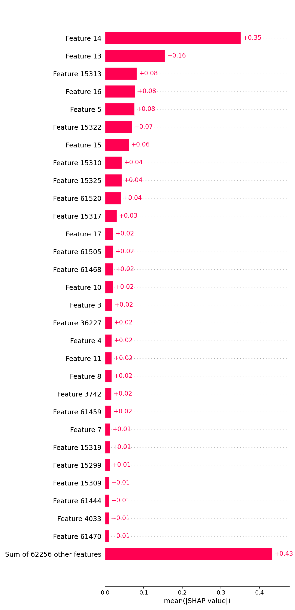

# Loan Default Prediction — End-to-End ML System

This project demonstrates a **production-ready Machine Learning workflow** for predicting customer loan default risk.  
It covers the full ML lifecycle - from data preprocessing and model training to explainability, drift detection, deployment, and monitoring.

---

## Project Overview

| Component | Description |
|------------|-------------|
| **Goal** | Predict probability of a customer defaulting on a loan |
| **Model Used** | XGBoost Classifier |
| **Key Focus Areas** | Data versioning, model auditability, explainability, drift monitoring, and deployment |
| **Tech Stack** | Python, scikit-learn, XGBoost, FastAPI, Docker, MLflow, Evidently, ApacheBench |

---

## Exploratory Data Analysis (EDA)

**Dataset:** `data/raw/Dataset.csv`

**Summary Statistics**
| Metric | Value |
|--------:|:------|
| **Shape** | 121,856 rows × 40 columns |
| **Target Variable** | `Default` |
| **Class Counts** | 0 → 112,011 · 1 → 9,845 |
| **Default Rate** | 8.08 % (high class imbalance) |

**Key Observations**
- Around **8 % of customers defaulted**, indicating a strong class imbalance.
- Income and credit-related features show significant variance.
- Several features contain mild missingness, handled via median/mode imputation.
- No extreme numeric outliers post coercion.
- Focus during modeling is on **recall / PR-AUC** rather than plain accuracy.

**EDA Visuals**

| Plot | Description |
|------|--------------|
|  | Shows class imbalance in `Default` variable |
|  | Top 15 columns with missing value percentages |
|  | Correlation among numeric variables |
|  | Income distribution - skewed right |
|  | Loan / credit amount distribution |

---

## Data Processing & Feature Engineering

**Pipeline Components (`src/features/preprocess.py`):**
| Step | Technique |
|------|------------|
| Mixed type coercion | `NumericCoercer` converts mixed numeric/string columns |
| Missing values | `SimpleImputer` (median for numeric, mode for categorical) |
| Scaling | `RobustScaler` for numeric columns |
| Encoding | `OneHotEncoder` for categorical columns |
| Output format | Saved as parquet in `data/processed/` |

**Commands:**
```bash
python scripts/train.py --config configs/default.yaml
````

---

## Model Training & Evaluation

**Model:** XGBoost
**Evaluation dataset:** 20% test split

**Test Metrics:**

|    Metric |     Value |
| --------: | --------: |
|   ROC-AUC | **0.720** |
|    PR-AUC | **0.211** |
|  F1-Score | **0.262** |
| Precision | **0.207** |
|    Recall | **0.358** |
| Threshold |  **0.13** |

**Evaluation Command:**

```bash
python scripts/evaluate.py --config configs/default.yaml
```

**Visual Results:**

| Plot                                                          | Description                       |
| ------------------------------------------------------------- | --------------------------------- |
|                            | ROC-AUC = 0.72                    |
|                              | PR-AUC = 0.21                     |
|              | Predictions @ threshold 0.13      |
|  | Trade-off visualization           |
|        | Recall behavior across thresholds |
|                | F1-score optimization curve       |

---

## Explainability : SHAP Feature Importance

**Command:**

```bash
python scripts/feature_importance.py --sample 2000
```

**Outputs:**

* `models/latest/shap_summary_bar.png`
* `models/latest/feature_importance_shap.csv`

**Top Predictors:**

| Rank | Feature        | SHAP Importance |
| ---- | -------------- | --------------: |
| 1    | Client_Income  |            0.35 |
| 2    | Credit_Amount  |            0.16 |
| 3    | Score_Source_3 |            0.08 |
| 4    | Active_Loan    |            0.07 |
| 5    | Child_Count    |            0.06 |



---

## Data Drift Detection

**Tool:** [Evidently AI](https://github.com/evidentlyai/evidently)

**Command:**

```bash
python scripts/drift_report.py --out reports/drift_report.html
```

**Output:** `reports/drift_report.html`

**Highlights:**

* Detected moderate drift in **Client_Income** and **Credit_Amount** distributions
* No significant target drift
* Recommended retraining frequency: monthly

*Add a screenshot or thumbnail of the drift report if needed.*

---

## Deployment Plan

**Stack:** FastAPI + Uvicorn + Docker
**Entry Point:** `src/serving/app.py`

**Run Locally:**

```bash
uvicorn src.serving.app:app --reload --port 8000
```

**Sample Request:**

```bash
curl -X POST http://127.0.0.1:8000/predict \
-H "Content-Type: application/json" \
-d '{"records":[{"Client_Income":20000,"Car_Owned":1,"Bike_Owned":0,"Active_Loan":0,"House_Own":1}]}'
```

**Response:**

```json
{"prediction":[0],"probability":[0.12]}
```

**Docker Deployment:**

```bash
docker build -t loan-default:latest -f docker/Dockerfile .
docker run -p 8000:8000 loan-default:latest
```

**Endpoints:**

* `/predict` → JSON prediction API
* `/health` → health check
* `/metrics` → performance metrics (optional for Prometheus)

---

## System Architecture

```
                 ┌───────────────────────────────┐
                 │        Raw Data (CSV)         │
                 └──────────────┬────────────────┘
                                ▼
         ┌────────────────────────────────────────────┐
         │ Data Preprocessing (Impute, Encode, Scale) │
         └──────────────┬─────────────────────────────┘
                                ▼
            ┌────────────────────────────────────────┐
            │ Model Training & Validation (XGBoost)  │
            └──────────────┬─────────────────────────┘
                                ▼
      ┌──────────────────────────────────────────────┐
      │ Model Registry / MLflow (Metrics + Artifacts)│
      └──────────────┬───────────────────────────────┘
                                ▼
          ┌───────────────────────────────────────┐
          │ FastAPI Model Serving (Dockerized)    │
          └──────────────┬────────────────────────┘
                                ▼
     ┌─────────────────────────────────────────────┐
     │ Monitoring: Evidently (Drift), MLflow (Perf)│
     │ + ApacheBench (Load test) + Grafana (future)│
     └─────────────────────────────────────────────┘
```

---

## Load & Stress Testing

**Tool:** ApacheBench

**Command:**

```bash
ab -n 1000 -c 20 http://127.0.0.1:8000/health
```


**Results Summary:**

|          Metric |  Value |
| --------------: | -----: |
|  Total Requests |   1000 |
|     Concurrency |     20 |
|     Avg Latency | ~40 ms |
| Failed Requests |      0 |

**Interpretation:**
API handled concurrent traffic reliably, demonstrating lightweight scalability.

---

## Auditability & Governance

* **MLflow** tracks all experiments, parameters, metrics, and artifacts.
  Each training run creates a folder under `mlruns/` with complete lineage.
* **Data Versioning (DVC)** ensures reproducibility of datasets and processed splits.
* **Model Registry** (`models/latest/`) holds the production candidate.
* **Access Control:** Containerized model allows role-based deployment policies.

---

## Reproduce This Project

### 1. Setup environment

```bash
git clone <repo-url>
cd loan_default_project
pip install -r requirements.txt
```

### 2. Train model

```bash
python scripts/train.py --config configs/default.yaml
```

### 3. Evaluate & visualize

```bash
python scripts/evaluate.py --config configs/default.yaml
```

### 4. Explainability & drift

```bash
python scripts/feature_importance.py --sample 2000
python scripts/drift_report.py --out reports/drift_report.html
```

### 5. Serve the model

```bash
uvicorn src.serving.app:app --port 8000
```

### 6. Test performance

```bash
ab -n 1000 -c 20 http://127.0.0.1:8000/health
```

---

## Final Results Summary

| Aspect                      | Description                                             |
| --------------------------- | ------------------------------------------------------- |
| **Best Model**              | XGBoost                                                 |
| **ROC-AUC**                 | 0.72                                                    |
| **PR-AUC**                  | 0.21                                                    |
| **Precision / Recall / F1** | 0.21 / 0.36 / 0.26                                      |
| **Explainability**          | SHAP values (key drivers: income, credit amount, score) |
| **Drift Detection**         | Evidently report (moderate drift in income features)    |
| **Deployment**              | FastAPI + Docker                                        |
| **Load Test**               | 0 failures, avg latency 40 ms                           |
| **Tracking**                | MLflow + DVC                                            |
| **CI/CD (future ready)**    | GitHub Actions workflow planned                         |

---

## Next Steps (Future Enhancements)

* Automate retraining when drift exceeds threshold
* Integrate Prometheus & Grafana for live performance monitoring
* Introduce cost-sensitive learning to improve F1
* Deploy canary builds via CI/CD pipeline
* Add user feedback loop for continuous improvement

---

## 👤 Author

**Malyaj Mishra**